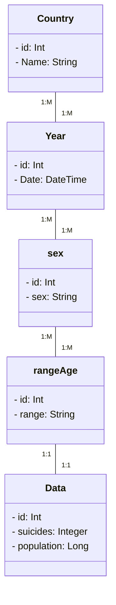

# Data Mining - Analysis Who Suicide?

* Rodrigo Antonio Martinez Macias
* 1896222

## Who suicide statistics

| Dato           | Descripcion                                                |
|----------------|------------------------------------------------------------|
| country        | pais donde sucedieron los hechos                           |
| year           | año el cual se registraron los sucesos                     |
| sex            | persona hombre o mujer                                     |
| age            | rango de edades de las personas                            |
| suicides_no    | cantidad de gente que cometió el acto                      |
| population     | total de poblacion por rango de edades en cada año         |

## Diagrama de objetos

## Authors

- [@theRobert174](https://www.github.com/theRobert174)

## 🚀 About Me
I'm a full stack developer... in development :)

